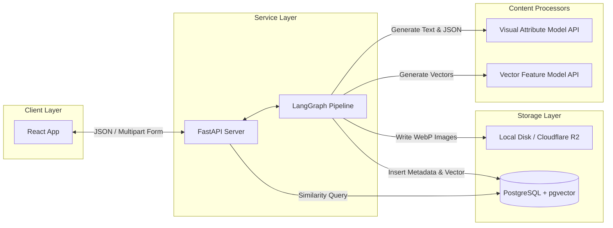
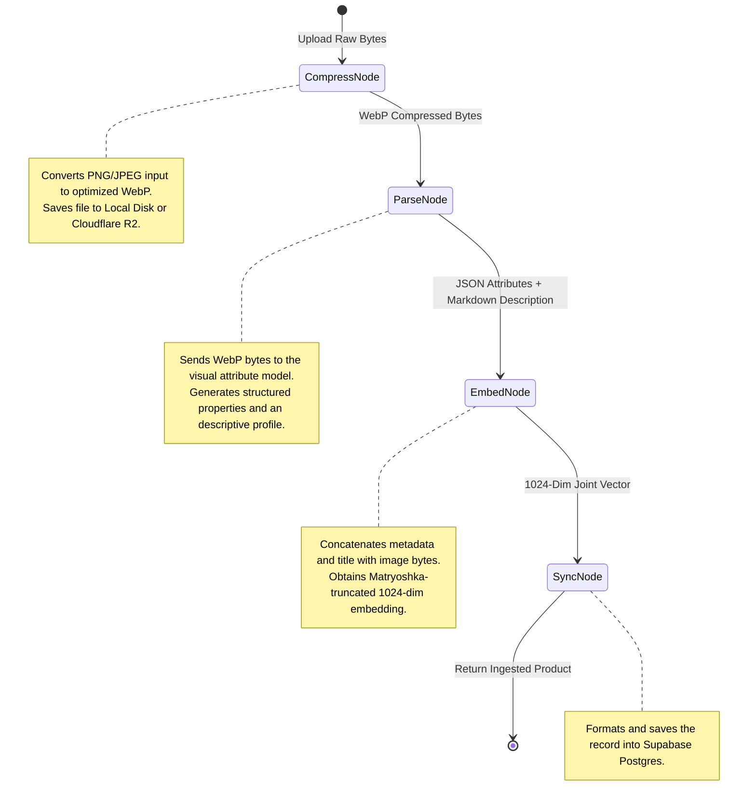

# System Design Document

This document outlines the current technical architecture and design of Kyrosaga, a Multimodal Product Catalogue Intelligence System.

## Architectural Component Overview



## Database Schema Design

The catalog is backed by a PostgreSQL database with the `pgvector` extension enabled. The primary table is `products`, defined as follows:

```sql
CREATE TABLE IF NOT EXISTS products (
    id UUID PRIMARY KEY DEFAULT gen_random_uuid(),
    title TEXT NOT NULL,
    price NUMERIC(10, 2) NOT NULL,
    inventory_count INT NOT NULL,
    image_url TEXT NOT NULL,
    ai_description TEXT,
    extracted_attributes JSONB DEFAULT '{}'::jsonb,
    embedding_coordinates VECTOR(1024),
    created_at TIMESTAMP WITH TIME ZONE DEFAULT timezone('utc'::text, now()) NOT NULL
);

-- Cosine similarity index for fast HNSW search
CREATE INDEX IF NOT EXISTS products_embedding_idx 
ON products 
USING hnsw (embedding_coordinates vector_cosine_ops);
```

- `extracted_attributes`: Contains JSON keys (`colour`, `style`, `material_type`, `shape`) parsed from the image by the visual attribute model.
- `embedding_coordinates`: 1024-dimensional floating-point array representing the joint visual-textual representation of the product.

## LangGraph Ingestion Pipeline

When a product is uploaded, a StateGraph orchestrates four sequential processing nodes. The system shares a common mutable state object [ProductIngestionState](file:///c:/Users/Bishwayan%20Chatterjee/Desktop/random/firse_webdev/rush-hours/genAI/Kyrosaga/Backend/my-fastapi-app/graph.py).



## Joint Multimodal Search Logic

Multimodal searching aligns text and images into a single coordinate space.

1. **Multimodal Alignment**:
   - When a user submits text only, the query vector is generated purely on the text content.
   - When a user submits an image (with optional text), the query vector is generated by passing both the text content and the image bytes to the embedding model API.

2. **Similarity Metric**:
   - Kyrosaga utilizes cosine distance to rank candidates: `1 - (embedding_coordinates <=> query_vector)`.

3. **Dynamic Filtering**:
   - Due to variance in vector clusters, text queries match at lower cosine ranges than image-heavy queries. The backend applies a dynamic threshold:
     - Text queries: `similarity >= 0.48`
     - Multimodal queries: `similarity >= 0.60`
