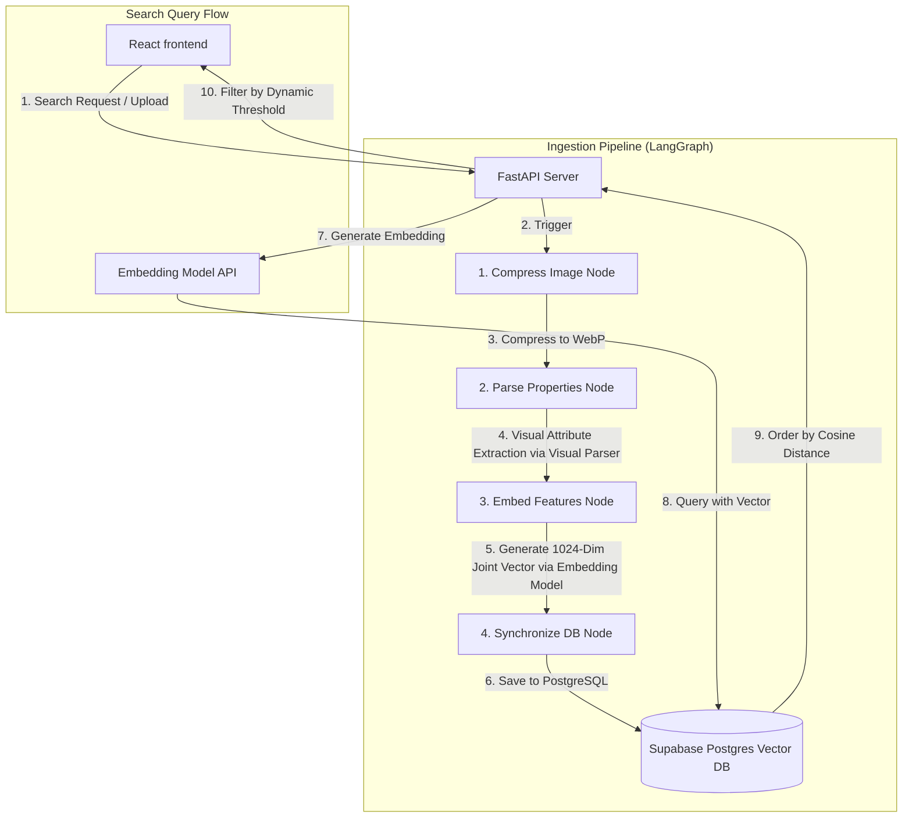

# Kyrosaga

Multimodal Product Catalogue Intelligence System

Kyrosaga is an automated product catalog management and semantic search application. It utilizes LangGraph for ingestion pipelines, specialized content models for attribute extraction and embedding generation, and PostgreSQL with pgvector for multimodal vector similarity searches.

## System Architecture



## Features Implemented

1. **Multimodal Search Interface**: Support for semantic text queries and visual drag-and-drop image queries.
2. **Dynamic Similarity Thresholding**:
    - Text-only queries use a similarity threshold of 48 percent (0.48) to capture lower baseline similarity scores.
    - Multimodal (text and image) queries use a similarity threshold of 60 percent (0.60) to prevent category leakage under higher baseline scores.
3. **Ingestion Graph**: LangGraph orchestrates image optimization, attribute parsing, embedding calculation, and database synchronization.
4. **Relational Pre-Filters**: Filter products by price, stock levels, style, material, color, and shape attributes.

## Core Codebase Structure

- [main.py](file:///c:/Users/Bishwayan%20Chatterjee/Desktop/random/firse_webdev/rush-hours/genAI/Kyrosaga/backend/main.py): Exposes REST API endpoints for product searching, retrieval, and uploads.
- [graph.py](file:///c:/Users/Bishwayan%20Chatterjee/Desktop/random/firse_webdev/rush-hours/genAI/Kyrosaga/backend/graph.py): Defines the product ingestion state graph using LangGraph.
- [embeddings.py](file:///c:/Users/Bishwayan%20Chatterjee/Desktop/random/firse_webdev/rush-hours/genAI/Kyrosaga/backend/embeddings.py): Connects with the embedding API using Matryoshka Representation Learning (MRL) for 1024-dimensional joint vector generation.
- [parser.py](file:///c:/Users/Bishwayan%20Chatterjee/Desktop/random/firse_webdev/rush-hours/genAI/Kyrosaga/backend/parser.py): Leverages the visual parser to extract properties (color, style, material, shape) and write descriptions.
- [storage.py](file:///c:/Users/Bishwayan%20Chatterjee/Desktop/random/firse_webdev/rush-hours/genAI/Kyrosaga/backend/storage.py): Manages local disk and Cloudflare R2 object storage operations.
- [db.py](file:///c:/Users/Bishwayan%20Chatterjee/Desktop/random/firse_webdev/rush-hours/genAI/Kyrosaga/backend/db.py): Handshakes with Postgres database using asynchronous pool configurations.
- [App.tsx](file:///c:/Users/Bishwayan%20Chatterjee/Desktop/random/firse_webdev/rush-hours/genAI/Kyrosaga/frontend/src/App.tsx): Interactive single-page React frontend dashboard.

## Setup and Installation

### Dependencies

Install python libraries:
```bash
pip install -r requirements.txt
```

Install node packages for the frontend:
```bash
cd frontend
npm install
```

### Running Backend Server

From the directory backend:
```bash
fastapi dev main.py
```

### Running frontend Server

From the directory frontend:
```bash
npm run dev
```

### Database Migrations

Apply local Supabase Postgres migrations:
```bash
npx supabase start
```

## Cloud Deployment (Hugging Face Spaces)

This project has been dockerized for easy deployment to Hugging Face Spaces.

### 1. Environment Variables needed in Cloud (HF Secrets)
To run this in the cloud, you will need the following API keys and URLs:
- `GEMINI_API_KEY`: Your Google Gemini API Key.
- `DATABASE_URL`: A cloud PostgreSQL connection string (e.g., from Supabase Cloud) with `pgvector` enabled.
- `STORAGE_DRIVER`: Set this to `r2` for cloud storage.
- `R2_ACCOUNT_ID`, `R2_ACCESS_KEY_ID`, `R2_SECRET_ACCESS_KEY`, `R2_BUCKET_NAME`, `R2_PUBLIC_URL`: Your Cloudflare R2 credentials for image storage.
- *(Optional)* `POSTHOG_API_KEY`, `POSTHOG_HOST`, `VITE_POSTHOG_API_KEY`, `VITE_POSTHOG_HOST` for analytics.

### 2. GitHub Actions (Health Ping)
A GitHub Action workflow is included in `.github/workflows/health-ping.yml` that will ping the `/api/health` endpoint daily. 
To enable this:
1. Add a secret `SPACE_URL` in your GitHub repository pointing to your HF Space URL (e.g., `https://username-spacename.hf.space`).
2. The action will automatically run every 24 hours to ensure your space stays awake.
