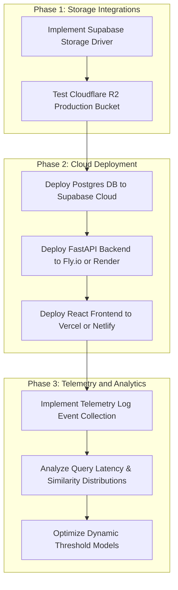
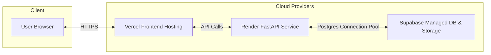

# Pending Roadmap Items

This document outlines the planned future features, cloud migrations, deployment pipelines, and telemetry systems required to transition Kyrosaga from a local MVP to a production-ready application.

## Development and Deployment Roadmap



---

## 1. Cloud Storage Implementations

To transition from local disk file hosting to highly available cloud storage, we need to complete the following integrations:

### Cloudflare R2 Storage Integration
* **Status**: The driver class `R2StorageDriver` is implemented in [storage.py](file:///c:/Users/Bishwayan%20Chatterjee/Desktop/random/firse_webdev/rush-hours/genAI/Kyrosaga/Backend/my-fastapi-app/storage.py) using `boto3`.
* **Tasks**:
    - Configure production variables in the backend `.env` (`R2_ACCOUNT_ID`, `R2_ACCESS_KEY_ID`, `R2_SECRET_ACCESS_KEY`, `R2_BUCKET_NAME`, `R2_PUBLIC_URL`).
    - Configure CORS policies on the Cloudflare dashboard to allow image reads and uploads from the frontend domain.

### Supabase Storage Integration
* **Status**: Not started.
* **Tasks**:
    - Create a new storage driver `SupabaseStorageDriver` implementing the `StorageDriver` protocol in [storage.py](file:///c:/Users/Bishwayan%20Chatterjee/Desktop/random/firse_webdev/rush-hours/genAI/Kyrosaga/Backend/my-fastapi-app/storage.py).
    - Utilize the `supabase` python SDK to perform authenticated uploads to a private/public bucket.
    - Implement fallback logic in the storage factory `get_storage_driver()` to instantiate the Supabase driver when `STORAGE_DRIVER` is configured to `supabase`.

---

## 2. Production Cloud Deployment



### Database Migration
* Migrate local Supabase tables and HNSW indexes to a managed database instance on Supabase Cloud.
* Apply migrations using the Supabase CLI pointing to the production database connection string.

### Backend Deployment
* Package the FastAPI application into a Docker container.
* Deploy to Render or Fly.io with environment variables configured for the feature model API access, Supabase DB connection, and Storage parameters.

### Frontend Deployment
* Set up a pipeline on Vercel or Netlify pointing to the Frontend sub-repository.
* Inject `VITE_API_BASE_URL` pointing to the deployed backend server address.

---

## 3. Telemetry Event Collection and Testing

To continuously monitor and improve search precision and threshold behavior, we need to implement a telemetry ingestion framework.

### Telemetry Pipeline Schema
A telemetry database table `search_telemetry` will track user search events and result quality:

```sql
CREATE TABLE IF NOT EXISTS search_telemetry (
    id UUID PRIMARY KEY DEFAULT gen_random_uuid(),
    session_id TEXT,
    query_text TEXT,
    has_image_query BOOLEAN NOT NULL,
    matched_product_ids UUID[],
    similarity_scores NUMERIC(5, 4)[],
    applied_threshold NUMERIC(4, 3) NOT NULL,
    processing_latency_ms INT NOT NULL,
    created_at TIMESTAMP WITH TIME ZONE DEFAULT timezone('utc'::text, now()) NOT NULL
);
```

### Data Collection Simulation for Telemetry Testing
To test and validate the telemetry capture, a testing harness will run query simulation scripts:
* **Script Implementation**: Write a python script `simulate_telemetry.py` to fire 100 randomized queries (50 text-only, 50 multimodal) at the backend server.
* **Metric Extraction**:
    - Log average query latency.
    - Capture the distribution of similarity scores across successful matches and empty matches.
    - Output stats to optimize the dynamic similarity threshold values (currently set to 48 percent and 60 percent).
